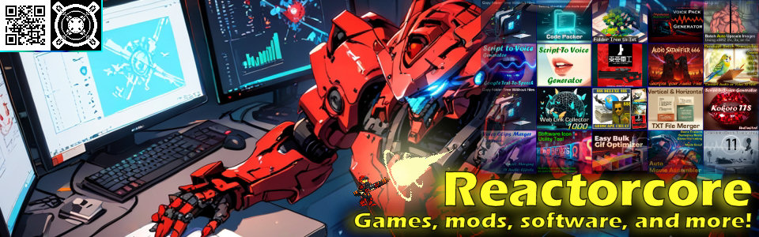

# Reactorcore Games

**Game designer. Developer. Modder. 2D/3D Artist. AI Prompt Engineer.**

One person. A lot of creative output. Games, mods, tools, and digital art — built solo across too many platforms, driven by community support and a genuine love of making things.

### [Visit the site →](https://reactorcoregames.github.io)

---

## What's here

**[Home](https://reactorcoregames.github.io)** — The hub. Find everything: support links, social media, professional work, and contact.

**[Catalogue](https://reactorcoregames.github.io/catalogue/)** — 227 projects across every platform. Games, mods, tools, art, LEGO mecha builds, and more — all in one place.

**[Privacy Policy](https://reactorcoregames.github.io/privacy/)** — No data collection, no tracking, no cookies. Ever.

---

## Find me elsewhere

| | |
|---|---|
| [Itch.io](https://reactorcore.itch.io/) | Games, mods, tools, and more |
| [Patreon](https://www.patreon.com/c/ReactorcoreGames) | Game design articles, project news & rewards |
| [Game Design Portfolio](https://rc-game-design-portfolio.pages.dev/) | Professional work and hire info |
| [YouTube](https://www.youtube.com/@reactorcoregames) | Videos |
| [X / Twitter](https://x.com/ReactorcoreDev) | Updates and posts |
| [Bluesky](https://bsky.app/profile/reactorcoregames.bsky.social) | Updates and posts |
| [DeviantArt](https://www.deviantart.com/reactorcore3/) | Art gallery |
| [Discord](https://discord.gg/UdRavGhj47) | Community server |
| [Ko-fi](https://ko-fi.com/reactorcoregames) | One-time support |
| [Buy Me an Orange](https://www.buymeacoffee.com/reactorcoregames) | One-time support |
